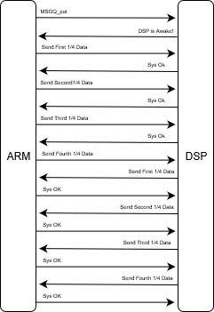
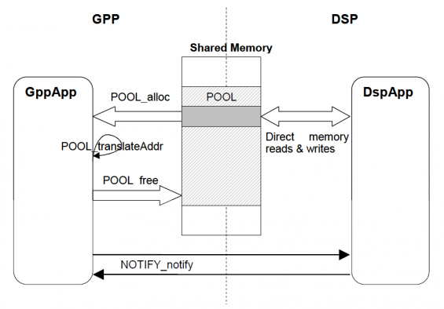
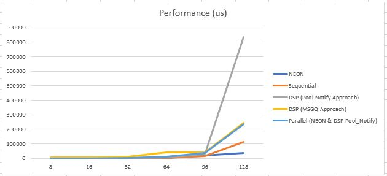
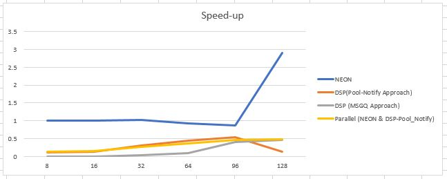

# Embedded System Lab 1 - Matrix Multiplication on Heterogeneous Computing Platform #

A task to implement a matrix multiplication on a heterogeneous computing platform is defined in this lab assignment. The chosen platform for the implementation is Beagleboard. 

There are two main component in the system that were utilized in this assignment; TMS320 DSP and ARM® Cortex™-A8 microprocessor. In the scope of this implementation the main processor (ARM Cortex-A8) will be called as GPP. The GPP unit is responsible for starting up, giving the task, and detaching the DSP core. The GPP also contains a NEON SIMD technology which help the parallel computation by computing multiple data on a single instruction, which help to achieve speed up.

### Methods ###

1. **MSGQ Approach In ARM and DSP**. The first method is to implement matrix multiplication on OMAP3530 is by using a MSGQ (message queue) component for sending messages between ARM and OMAP3530.  On the message component, there are two extra fields that were added, the size of matrix and the matrix itself. The matrix was implemented using union between two 16-bit input matrix and one 32-bit output matrix to reduce the memory needed when transferring the data.

2. **Pool-Notify Approach - DSP Only**. Another way to do sending/receiving data between GPP and DSP is by using the shared memory. The shared memory will be utilized to store the input and output matrices (see Figure below). The main advantage of using pool notify approach is that it has less communication overhead between GPP and DSP, because the data is transferred through shared memory

### Results ###

The speed and performance of each methods are shown below.

Based on our experiments on various methods, our proposed final solution for matrix multiplication application is using NEON, as it is the only method that can maintain the performance in lower matrix size and can achieve 3 times speed up for big matrix size, especially 128.  

### Conclusion ###
After implementing several methods in order to optimize the matrix multiplication in Beagleboard Rev C4, the conclusion of this assignment are :

- ARM® Cortex™-A8 has a 128-bit SIMD instruction called NEON which can do computation in parallel.
- Utilizing ARM and DSP in parallel is implemented in order to increase the optimization, u.  
- Serial communication and shared memory are used to send and receive data between ARM and DSP cores. 
- The highest speed up (around 3 times) is achieved by NEON alone when the matrix size is 128. 
